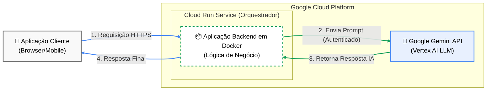

# STRIDE Threat Analyzer

AI-powered cloud architecture security analysis using the **STRIDE** threat modeling methodology.

Upload a cloud architecture diagram (AWS, Azure, or GCP) and receive a comprehensive threat model report — powered by **Google Gemini**.

## Project Context & Evolution

Initially, this project explored using a custom-trained YOLO computer vision model to recognize cloud components. However, curating a balanced dataset for over a thousand component classes proved inefficient due to time and hardware constraints, resulting in low detection accuracy.

To overcome this, the architecture was pivoted to leverage **Generative AI (Google Gemini)**. By utilizing a multimodal LLM, the system bypasses the complex optical training phase, analyzing diagrams directly with high precision and cross-referencing them with the STRIDE framework.

## Architecture


## Key Features

- **Automated Threat Modeling**: Analyzes architecture diagrams using Gemini to identify components, data flows, and trust boundaries.
- **Token & Cost Optimization**: Automatically resizes and optimizes images before API transmission to reduce token usage and handles quota limits gracefully.
- **Export to PDF**: Generates a clean, academic-style PDF report with a formal layout (white background, dark text, blue headers).
- **Export to Excel**: Downloads the threat model as an actionable spreadsheet, including crucial `Status` and `Notes` columns for continuous tracking and remediation.

## How It Works

1. **Upload** your cloud architecture diagram through the web UI.
2. **AI Analysis**: Gemini processes the image, interpreting the architecture context.
3. **STRIDE Report**: A detailed report is generated with threats and mitigations dynamically rendered on screen.
4. **Export & Track**: Download the evidence as PDF or Excel to share with your security and infrastructure teams.

The STRIDE methodology evaluates six threat categories:
- **S**poofing — identity impersonation
- **T**ampering — data/code modification
- **R**epudiation — untraceable actions
- **I**nformation Disclosure — data exposure
- **D**enial of Service — availability attacks
- **E**levation of Privilege — unauthorized access

## Quick Start (Docker)

### Prerequisites
- Docker
- A [Gemini API key](https://aistudio.google.com/apikey) (free)

### Build & Run

```bash
# Build the image
docker build -t stride-analyzer .

# Run the container (pass your API key as an env var)
docker run -p 8080:8080 -e GEMINI_API_KEY="your-key-here" stride-analyzer
```

Then open **http://localhost:8080** in your browser.

### Environment Variables

| Variable | Required | Default | Description |
|---|---|---|---|
| `GEMINI_API_KEY` | **Yes** | — | Your Gemini API key from [AI Studio](https://aistudio.google.com/apikey) |
| `GEMINI_MODEL` | No | `gemini-2.0-flash-lite` | Gemini model to use (e.g. `gemini-2.5-flash-lite`) |
| `PORT` | No | `8080` | Server port (auto-set by Cloud Run) |

## Running Without Docker

```bash
# Install dependencies
pip install -r requirements.txt

# Set your API key
export GEMINI_API_KEY="your-key-here"

# Run the development server
python src/main.py
```

## Deploying to Google Cloud Run

### 1. Store your API key in Secret Manager

```bash
echo -n "YOUR_GEMINI_API_KEY" | \
  gcloud secrets create gemini-api-key --data-file=-

# Grant Cloud Run access to read the secret
gcloud secrets add-iam-policy-binding gemini-api-key \
  --member="serviceAccount:YOUR_PROJECT_NUMBER-compute@developer.gserviceaccount.com" \
  --role="roles/secretmanager.secretAccessor"
```

### 2. Build & push the image

```bash
gcloud builds submit --tag gcr.io/YOUR_PROJECT_ID/stride-analyzer
```

### 3. Deploy

```bash
gcloud run deploy stride-analyzer \
  --image gcr.io/YOUR_PROJECT_ID/stride-analyzer \
  --platform managed \
  --region us-central1 \
  --allow-unauthenticated \
  --set-secrets="GEMINI_API_KEY=gemini-api-key:latest" \
  --set-env-vars="GEMINI_MODEL=gemini-2.5-flash-lite" \
  --memory=512Mi \
  --timeout=120
```

> The `--set-secrets` flag injects the API key as an environment variable at runtime — it never appears in the image, source code, or deploy logs.

## Project Structure

```
├── Dockerfile              # Container image definition (Cloud Run ready)
├── requirements.txt        # Python dependencies
├── src/
│   ├── main.py             # Flask web application
│   ├── services/
│   │   └── gemini_analyzer.py  # Gemini API integration & STRIDE prompt
│   ├── templates/
│   │   └── index.html      # Web UI (upload + report display)
│   └── static/
│       ├── app.js          # Core UI logic
│       ├── excel-export.js # Excel generation logic
│       ├── pdf-export.js   # PDF generation logic
│       └── style.css       # UI styling
└── input_images/           # Sample architecture diagrams
```

## Technology Stack

- **Backend**: Python 3.10 + Flask + Gunicorn
- **AI**: Google Gemini (via `google-genai` SDK)
- **Container**: Docker
- **Deployment**: Google Cloud Run
- **Frontend**: Vanilla HTML/CSS/JS with modern dark theme
- **Client Libraries**: `html2pdf.js` (PDF export), `SheetJS/xlsx` (Excel export)

